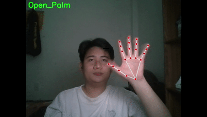
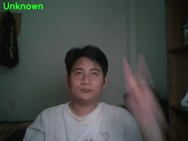

# 👋 Control The System With Hand Gestures


## 📖 Introduction
This project uses a webcam, MediaPipe, and deep learning to transform your hand gestures into commands. We've developed a robust Python application that allows you to control basic system tasks smoothly and intuitively, eliminating the need to touch your keyboard or mouse.

With a simple and user-friendly graphical interface (GUI), you can easily switch between different control modes. From pausing/playing videos, changing songs, and adjusting volume to advancing slides during presentations.

Everything is right in the palm of your hand!

---

## ✨ Features
### Video Control
- **Pause/Play Video:**  
   - **Activation:** Open your hand, then make a fist.  
   - **Effect:** If the video or audio is paused, it will play, and vice versa.
   - **Example Gesture:**
   
- **Next Media:**  
   - **Activation:** Show a "like" gesture (thumbs up), then open your hand and make a fist.  
   - **Effect:** Skips to the next song or video.
   - **Example Gesture:**
   
- **Previous Media:**  
   - **Activation:** Show a "dislike" gesture (thumbs down), then open your hand and make a fist.  
   - **Effect:** Returns to the previous song or video.
   - **Example Gesture:**
   
- **Open App:**  
   - **Activation:** Show a "HI" or "Victory" gesture (peace sign), then open your hand and make a fist.  
   - **Effect:** Opens the MediaPlayer application.
   - **Example Gesture:**
   
- **Change Volume:**  
   - **Activation:** Show an "OK" or "I love you" gesture.  
   - **Effect:** Use the "like" gesture to increase volume and the "dislike" gesture to decrease volume.  
   - **Deactivation:** Open your hand and make a fist to finish changing the volume.
   - **Example Gesture:**
   

### Slide Control
- **Next slide:**  
   - **Activation:** Open your hand, then make a fist.  
   - **Effect:** Moves to the next slide.
   - **Example Gesture:**
   
- **Previous slide:**  
   - **Activation:** Use the "Pointing up" gesture.  
   - **Effect:** Returns to the previous slide.
   - **Example Gesture:**
   

### Change Mode
- **Activation:** Use the interface to switch between control modes for slides or videos.
- **Example action:** 


### Message log
- **Effect:** Displays notifications about your status and actions.
- **Example action:** 


---

## 🚀 Technologies Used
- **Python:** Main programming language.
- **Mediapipe:** Hand gesture detection and tracking.
- **OpenCV:** Webcam video processing.
- **Tkinter:** Graphical interface.
- **Pycaw & Comtypes:** System volume control.
- **Pyautogui & Pygetwindow:** Sending media control key presses.
- **TensorFlow:** Deep learning model for gesture classification.

---

## 📥 Installation
### Requirements:
- Python 3.10+
- Functional webcam.

### Install Dependencies:
```bash
pip install -r requirements.txt
```

### Run the Program:
```bash
python main.py
```

---

## ⚙️ How to Use
1. Run `main.py` to start application.
2. Ensure your webcam is active and visible. The application will display a small preview window.
3. Show your hand(s) clearly in front of the camera and use the following gestures to control your media or slides.
4. Observe the on-screen status displayed in the small camera window for real-time feedback on recognized gestures and current mode.
5. To switch between Video Control and Slide Control modes, use the application's system tray interface—see instructions in the "Change Mode" section.
6. To exit the application, select "Exit" from the application's GUI.
---

## 📋 Notes
- Ensure good lighting conditions for accurate gesture recognition.
- When Volume mode is enabled, remember to turn it off by opening your hand and then making a fist; only then can you use other gestures.
- You can open an application other than MediaPlayer. See line 277 in the `systerm_control_by_handgesture.py` file.
- You can add new gestures and train the program to improve gesture accuracy using the `record_and_collect_data.py` and `train_model.py` files.
   - The `record_and_collect_data.py` file helps you save gesture data by recording landmark points into a CSV file.
   - The `train_model.py` file processes the collected CSV data and trains the model, producing `gesture_recognition_model.h5` and `scaler.pkl`.
   - After training, simply use these two files to enable gesture recognition in your application.
- I hope this repo is helpful to you! Thank you for reading my repo!

---

## 📞 Author
- **Name:** DO DANG HOAN
- **Contact:** dodanghoana12017@gmail.com
